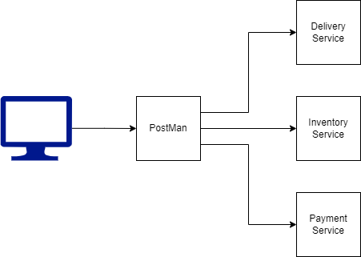

# **Laboratorio N1**
**Curso:** Tópicos Especiales en Telemática  
**Título:** Comunicación entre Procesos Remotos: gRPC. 
**Estudiante** Andrés Echeverri Jaramillo 
### **1. Descripción**
En este laboratorio se desarrollaron 3 microservicios los cuales dos estan hechos en Python: el servicio de pagos (Payment) y el servicio de inventario (Inventory), y uno en Node.js: el servicio de entregas (Delivery), cada una tiene su archivo proto correspondiente para la comunicación con gRPC.

### **2. Estructura**
